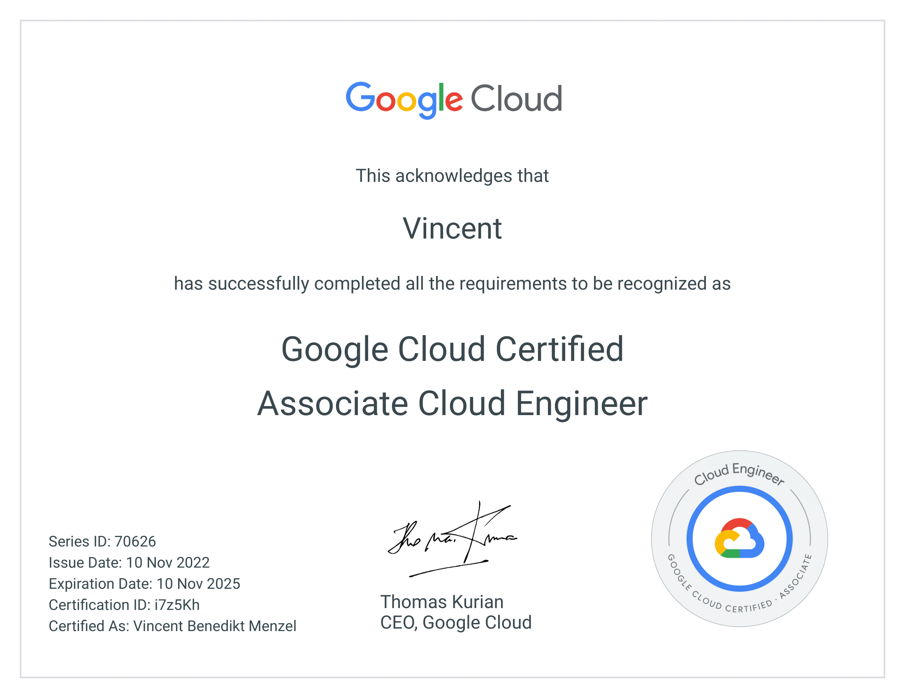

### About Me:
I enjoy trying new languages, framework and tech 🤓 if you are  likeminded lets have a chat 💬

### My favorite cloud platform: 

### My favorite languages:

### My favorite frameworks:

### Other tools I like:

### I enjoy doing some coding challenges and stackoverflow anwers on the side

## Certifications
 &emsp;
 &emsp;

## My Statistics

<!--
Here are some ideas to get you started:

- 🔭 I’m currently working on ...
- 🌱 I’m currently learning ...
- 👯 I’m looking to collaborate on ...
- 🤔 I’m looking for help with ...
- 💬 Ask me about ...
- 📫 How to reach me: ...
- 😄 Pronouns: ...
- ⚡ Fun fact: ...

https://gist.github.com/rxaviers/7360908
https://github.com/alexandresanlim/Badges4-README.md-Profile
https://github.com/murilothink/github-readme-stats
https://github.com/itecompro/markdown-emoji-cheatsheet
https://github.com/anuraghazra/github-readme-stats
-->
