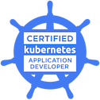

### About Me:
Senior Software Developer at PCG GmbH. Coding enthusiast on a perpetual adventure to discover and play with new tech and languages! 👨‍💻

[![Portfolio](https://img.shields.io/badge/vincentmenzel.com-black?style=for-the-badge&logo=&logoColor=white)](https://vincentmenzel.com)

### Core stack:
`TypeScript` · `Go` · `Python` · `Rust` · `Node.js` · `NestJS` · `Docker` · `Kubernetes` · `Terraform` · `Postgres` · `AWS` · `GCP`

### Other tools I like:

### I enjoy doing some coding challenges and stackoverflow answers on the side

## Certifications

 &emsp;

## My Statistics

<!-- Auto-generated from http://localhost:8792/profile.json by scripts/generate-readme.ts — do not edit by hand.
Last synced: 2026-07-30T14:26:41.828Z -->
