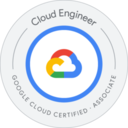

### About Me:

I enjoy trying new languages, framework and tech 🤓 if you are  likeminded lets have a chat 💬

### My favorite cloud platform: 
- [Google Cloud Platform]

[Google Cloud Platform]: https://cloud.google.com/

### My favorite languages:
- [Javascript]
- [Typescript]
- [Python]
- [Bash]
- [SQL]
- [Golang]

[Javascript]: https://www.javascript.com/
[Typescript]: https://www.typescriptlang.org/
[Python]: https://www.python.org/
[Bash]: https://www.gnu.org/software/bash/
[SQL]: https://www.mysql.com/
[Golang]: https://go.dev/

### My favorite frameworks:
- [Nestjs]
- [Angular]
- [React]

[Nestjs]: https://nestjs.com/
[Angular]: https://angular.io/
[React]: https://reactjs.org/

### Other tools I like:
- [Git]
- [Kubernetes]
- [Terraform]
- [Docker]
- [Linux]

[Git]: https://git-scm.com/
[Kubernetes]: https://kubernetes.io/
[Terraform]: https://www.terraform.io/
[Docker]: https://www.docker.com/
[Linux]: https://www.linux.org/

### I enjoy doing some coding challenges and stackoverflow anwers on the side
- [Stackoverflow]
- [Codingame]
- [Codewars]
- [Leetcode]

[Stackoverflow]: https://stackoverflow.com/users/11941549/vincent-menzel
[Codingame]: https://www.codingame.com/profile/494eefed5a0393eaae332fa0b4643e849231024
[Codewars]: https://www.codewars.com/users/VincentMenzel
[Leetcode]: https://leetcode.com/VincentMenzel/

## Certifications
 &emsp;
 &emsp;

